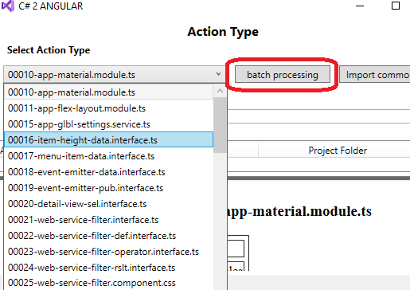

# CS2Angular
## Free Open Source tool


### Table of content
#### [000 SUMMARY](#00-SUMMARY) 
##### [SUMMARY 00.1 CREATING PROJECT FOR ANGULAR MATERIAL AND ANGULAR MATERIAL DESIGN ICONS](#001-CREATING-PROJECT-FOR-ANGULAR-MATERIAL-AND-ANGULAR-MATERIAL-DESIGN-ICONS)
##### [SUMMARY 00.2 CREATING PROJECT FOR NG BOOTSTRAP AND MATERIAL DESIGN ICONS](#002-CREATING-PROJECT-FOR-NG-BOOTSTRAP-AND-MATERIAL-DESIGN-ICONS)
##### [SUMMARY 00.3 CREATING PROJECT FOR NG BOOTSTRAP AND AWESOME ICONS](#003-CREATING-PROJECT-FOR-NG-BOOTSTRAP-AND-AWESOME-ICONS)
#### [001 INTRODUCTION](#01-INTRODUCTION)
#### [002 INSTALLATION AND T4-SCRIPS](#02-INSTALLATION-AND-T4-SCRIPS)
#### [003 CREATING PROJECTS TO START DEVELOPMENT](#03-CREATING-PROJECTS-TO-START-DEVELOPMENT)
#### [004 PREPARATION STEPS AFTER CREATING PROJECTS](#04-PREPARATION-STEPS-AFTER-CREATING-PROJECTS)
#### [005 FIRST ENTITY AND DBCONTEXT](#05-FIRST-ENTITY-AND-DBCONTEXT)
#### [006 FIRST VIEW AND WIZARD REPOSITORY](#06-FIRST-VIEW-AND-WIZARD-REPOSITORY)
#### [007 FIRST WEB API SERVICE](#07-FIRST-WEB-API-SERVICE)
#### [008 AUXILIARY ANGULAR TYPESCRIPT CLASSES](#08-AUXILIARY-ANGULAR-TYPESCRIPT-CLASSES)
#### [009 AUXILIARY CLASSES. WHAT IS IN THE BOX](#09-AUXILIARY-CLASSES.-WHAT-IS-IN-THE-BOX)
#### [010 ANGULAR CLASSES FOR THE FIRST VIEW](#10-ANGULAR-CLASSES-FOR-THE-FIRST-VIEW)
#### [011 SOME NOTES ABOUT AUTHORIZATION](#11-SOME-NOTES-ABOUT-AUTHORIZATION)

## 00 SUMMARY
##### [SUMMARY 00.1 CREATING PROJECT FOR ANGULAR MATERIAL AND ANGULAR MATERIAL DESIGN ICONS](#001-CREATING-PROJECT-FOR-ANGULAR-MATERIAL-AND-ANGULAR-MATERIAL-DESIGN-ICONS)
##### [SUMMARY 00.2 CREATING PROJECT FOR NG BOOTSTRAP AND MATERIAL DESIGN ICONS](#002-CREATING-PROJECT-FOR-NG-BOOTSTRAP-AND-MATERIAL-DESIGN-ICONS)
##### [SUMMARY 00.3 CREATING PROJECT FOR NG BOOTSTRAP AND AWESOME ICONS](#003-CREATING-PROJECT-FOR-NG-BOOTSTRAP-AND-AWESOME-ICONS)

### 001 CREATING PROJECT FOR ANGULAR MATERIAL AND ANGULAR MATERIAL DESIGN ICONS
- For more information, please visit ANGULAR MATERIAL and MATERIAL DESIGN ICONS sites

https://material.angular.io/

https://material.io/resources/icons/?style=baseline

### Step #1
- Run Windows command prompt cmd.exe
- Go to the parent folder for your app
```java
   cd PARENT_FOLDER_FOR_YOUR_APP
```
### Step #2
- To create the angular project enter the command:
```java
   ng new YOUR_APP
```
-   Select Angular routing = yes
-   Select  Stylesheet format = css
### Step #3
-   enter command
```java
   cd YOUR_APP
```
### Step #4
-   enter command
```java
   ng add @angular/material
```
-   Choose Analytics  = no
-   Choose “Indigo/Pink”
-   Set up global Angular Material typography styles = yes
-   Set up browser animations for Angular Material = yes

### Step #5
- After creating very first view (C# part of the project)
- Launch Visual Studio 2019 and open the server-side solution. The server-side solution includes C # Entity, C # Views, and C # WebApi Services. 
-   In the solution explorer right click solution node add select “Add/Existing Web site” menu item
-   In the dialog select the folder:
```java
   YOUR_APP\src
```
-   Note: DO NOT select a folder for the entire angular application:
```java
                YOUR_APP
```

### Step #6
- After creating very first view (C# part of the project)
- Launch Visual Studio 2019 
- Right Click the following folder of your angular project
```java
                src\app
```
- In the context menu select Add/JavaScripts Wizard


- On the first page click next


- On the second page select the project and Db context of your Entities. Click Next.


- On the third page select "==Context==". Click Next.


- On the fourth page click "Batch processing"-button.


- In the "Batch actions" dialog select "00000-ContextLevelBatch.json"  and click "start"-button.


- In the "Batch actions" dialog select "00200-app-glbl-auth.json"  and click "start"-button.


- In the "Batch actions" dialog select "00230-appCompAndModule.json"  and click "start"-button.
 


### Step #9
- Configure URLs to connect to server-side servicesConfigure URLs to connect to server-side services.
-   open src\app\shared\services\app-glbl-settings.service.ts
-   modify two methods:
```java
    public getWebApiPrefix(vwNm: string): string {
        let reslt: string = '';
        if(!(vwNm === null)) {
            if(!(vwNm === null)) {
                reslt = 'https://localhost:44312/'; // Set up URLs to connect to server-side services.
            }
        }
        return reslt;
    } 
    public getSecurityWebApiPrefix(): string {
        return 'https://localhost:44312/'; // Set up URLs to connect to server-side services.
    } 
```

### Step #10
- Note: to generate components for the given view please use the batch actions without any suffix. There two possible ones.

```java
   ...NGB.json
   ...NGB-awesome.json
```

- with the following two exceptions:

```java
   01100-Interfaces.json
   01400-WebApiService.json
```

- these two batches apply to any user interface library

### Notes about Authorization
- Authorization is turned off by default. To turn it on
-   open src\app\shared\services\app-glbl-settings.service.ts
-   modify two methods:
```java
    getViewModelMask(vwModel: string): number {
      return 15; // delete this line when vwModels is ready
      ...
    } 
    getDashBrdMask(dshBrd: string): number {
      return 1; // delete this line when dshBrds is ready
      ...
    } 
```


## 002 CREATING PROJECT FOR NG BOOTSTRAP AND MATERIAL DESIGN ICONS
- For more information, please visit NG BOOTSTRAP and MATERIAL DESIGN ICONS sites

https://ng-bootstrap.github.io/

https://material.io/resources/icons/?style=baseline

### Step #1
- Run Windows command prompt cmd.exe
- Go to the parent folder for your app
```java
   cd PARENT_FOLDER_FOR_YOUR_APP
```
### Step #2
- To create the angular project enter the command:
```java
   ng new YOUR_APP
```
-   Select Angular routing = yes
-   Select  Stylesheet format = css
### Step #3
-   enter command
```java
   cd YOUR_APP
```
### Step #4
-   enter command
```java
   npm install material-design-icons
```
- in the file styles.css add the following line: 
```java
   @import '~material-design-icons/iconfont/material-icons.css'; 
```

### Step #5
-   enter command
```java
   npm i -s @angular/flex-layout@9.0.0-beta.31 @angular/cdk
```

### Step #6
-   enter command
```java
   ng add @ng-bootstrap/ng-bootstrap
```

### Step #7
- After creating very first view (C# part of the project)
- Launch Visual Studio 2019 and open the server-side solution. The server-side solution includes C # Entity, C # Views, and C # WebApi Services. 
-   In the solution explorer right click solution node add select “Add/Existing Web site” menu item
-   In the dialog select the folder:
```java
                YOUR_APP\src
```
-   NOTE: DO NOT select a folder for the entire angular application:
```java
                YOUR_APP
```

### Step #8
- After creating very first view (C# part of the project)
- Launch Visual Studio 2019 
- Right Click the following folder of your angular project
```java
                src\app
```
- In the context menu select Add/JavaScripts Wizard


- On the first page click next


- On the second page select the project and Db context of your Entities. Click Next.


- On the third page select "==Context==". Click Next.


- On the fourth page click "Batch processing"-button.


- In the "Batch actions" dialog select "00000-ContextLevelBatchNGB.json"  and click "start"-button.


- In the "Batch actions" dialog select "00200-app-glbl-authNGB.json"  and click "start"-button.


- In the "Batch actions" dialog select "00230-appCompAndModuleNGB.json"  and click "start"-button.
 

 

### Step #9
- Configure URLs to connect to server-side servicesConfigure URLs to connect to server-side services.
-   open src\app\shared\services\app-glbl-settings.service.ts
-   modify two methods:
```java
    public getWebApiPrefix(vwNm: string): string {
        let reslt: string = '';
        if(!(vwNm === null)) {
            if(!(vwNm === null)) {
                reslt = 'https://localhost:44312/'; // Set up URLs to connect to server-side services.
            }
        }
        return reslt;
    } 
    public getSecurityWebApiPrefix(): string {
        return 'https://localhost:44312/'; // Set up URLs to connect to server-side services.
    } 
```

### Step #10
- Note: to generate components for the given view please use the batch actions with the suffix

```java
   ...NGB.json
```

- with the following two exceptions:

```java
   01100-Interfaces.json
   01400-WebApiService.json
```

- these two batches apply to any user interface library

### Notes about Authorization
- Authorization is turned off by default. To turn it on
-   open src\app\shared\services\app-glbl-settings.service.ts
-   modify two methods:
```java
    getViewModelMask(vwModel: string): number {
      return 15; // delete this line when vwModels is ready
      ...
    } 
    getDashBrdMask(dshBrd: string): number {
      return 1; // delete this line when dshBrds is ready
      ...
    } 
```


## 003 CREATING PROJECT FOR NG BOOTSTRAP AND AWESOME ICONS
- For more information, please visit NG BOOTSTRAP and AWESOME ICONS sites

https://ng-bootstrap.github.io/

https://www.npmjs.com/package/@fortawesome/angular-fontawesome

### Step #1
- Run Windows command prompt cmd.exe
- Go to the parent folder for your app
```java
   cd PARENT_FOLDER_FOR_YOUR_APP
```
### Step #2
- To create the angular project enter the command:
```java
   ng new YOUR_APP
```
-   Select Angular routing = yes
-   Select  Stylesheet format = css
### Step #3
-   enter command
```java
   cd YOUR_APP
```
### Step #4
-   enter command
```java
   ng add @fortawesome/angular-fontawesome@0.6.1
```
- choose: 
    - free regular icons (far for fontawesome-free-regular)
    - free solid icons (fas for fontawesome-free-solid)
    - free brands icons (fab for fontawesome-free-brands)

### Step #5
-   enter command
```java
   npm i -s @angular/flex-layout@9.0.0-beta.31 @angular/cdk
```

### Step #6
-   enter command
```java
   ng add @ng-bootstrap/ng-bootstrap
```

### Step #7
- After creating very first view (C# part of the project)
- Launch Visual Studio 2019 and open the server-side solution. The server-side solution includes C # Entity, C # Views, and C # WebApi Services. 
-   In the solution explorer right click solution node add select “Add/Existing Web site” menu item
-   In the dialog select the folder:
```java
   YOUR_APP\src
```
-   NOTE: DO NOT select a folder for the entire angular application:
```java
                YOUR_APP
```

### Step #8
- After creating very first view (C# part of the project)
- Launch Visual Studio 2019 
- Right Click the following folder of your angular project
```java
                src\app
```
- In the context menu select Add/JavaScripts Wizard


- On the first page click next


- On the second page select the project and Db context of your Entities. Click Next.


- On the third page select "==Context==". Click Next.


- On the fourth page click "Batch processing"-button.


- In the "Batch actions" dialog select "00000-ContextLevelBatchNGB-awesome.json"  and click "start"-button.


- In the "Batch actions" dialog select "00200-app-glbl-authNGB-awesome.json"  and click "start"-button.


- In the "Batch actions" dialog select "00230-appCompAndModuleNGB-awesome.json"  and click "start"-button.
 


### Step #9
- Configure URLs to connect to server-side servicesConfigure URLs to connect to server-side services.
-   open src\app\shared\services\app-glbl-settings.service.ts
-   modify two methods:
```java
    public getWebApiPrefix(vwNm: string): string {
        let reslt: string = '';
        if(!(vwNm === null)) {
            if(!(vwNm === null)) {
                reslt = 'https://localhost:44312/'; // Set up URLs to connect to server-side services.
            }
        }
        return reslt;
    } 
    public getSecurityWebApiPrefix(): string {
        return 'https://localhost:44312/'; // Set up URLs to connect to server-side services.
    } 
```

### Step #10
- Note: to generate components for the given view please use the batch actions with the sufix

```java
   ...NGB-awesome.json
```

- with the following two exceptions:

```java
   01100-Interfaces.json
   01400-WebApiService.json
```

- these two batches apply to any user interface library

### Notes about Authorization
- Authorization is turned off by default. To turn it on
-   open src\app\shared\services\app-glbl-settings.service.ts
-   modify two methods:
```java
    getViewModelMask(vwModel: string): number {
      return 15; // delete this line when vwModels is ready
      ...
    } 
    getDashBrdMask(dshBrd: string): number {
      return 1; // delete this line when dshBrds is ready
      ...
    } 
```


## 01 INTRODUCTION
- implemented as Microsoft Visual Studio Extension (.vsix)
- consists of five wizards:
- DBContext Wizard
- ModelViews Wizard
- WebApiServices Wizard
- JavaScripts Wizard
- FeatureScripts Wizard
### The following requirements must be met to begin development:
- Microsoft Visual Studio 2019 (community edition or higher)
- Visual Studio Code
- NodeJs (https://nodejs.org)
- TypeScript (npm install -g typescript)
- Angular Cli (npm install –g @angular/cli)
### Important note:
- Wizards generate code based on the Angular Material UI component library
- Generator scripts for ng-bootstrap and / or ngx-bootstrap have not yet been implemented.
### Talking about "generator scripts":
- Generators are built on the basis of "T4 Text Template"-Microsoft technology.
- As a result, the developer can modify or rewrite any T4 script at any time.
- The latter makes CS2ANGULAR an extremely flexible application development tool that speeds up the development process by several times.
### The development process cycle consists of the following steps: 
- The developer starts with first entity which is C# Entity Framework class.
- Using DBContext Wizard generates new or modify existing Entity Framework DB-Context.
- Using ModelViews Wizard defines and generates Views which is subset of properties of current Entity and its masters
- Using WebApiServices Wizard defines and generates Web Api Services
- Using JavaScripts Wizard defines and generates rich client interface as typescript components
- Using FeatureScripts Wizard arranges generated components on the pages
- The developer adds next entity to the project and repeats all the steps above.
### Typical Web App
- Now it's time to get acquainted with a typical Web application created using CS2ANGULAR.
- An overview of the main aspects of such an application will help illuminate the class of tasks whose solution CS2ANGULAR automates.
- In other words, the goal is to show what you can get at the end of the development process
### We start from DBContext structure

- Country is a master for
    - Dialect, Publisher, Author 
- Language is a master for
    - Dialect
- Genre, Author, Dialect are masters for
    - Manuscript
- Manuscript, Publisher, Edition are masters for
    - Book

### Creating such a strange database, we sought to achieve two goals:
- have a master-detail chain longer than two:
    - Country > Author > Manuscript > Book
    - Country > Dialect > Manuscript > Book
- have a node that has more than one master:
    - Dialect, Genre, Author are masters for Manuscript

### With CS2ANGULAR, a developer can model and generate editing forms with master-detail relationships at the user-controls level with a following rules :
- any user-control of the detailed-entity is disabled until the user control of the master-entity is defined :
    - For instance, user-control  for Manuscript will be disabled until the user-control for Author is defined
- any user-control of the detailed-entity displays data with applied filter defined by the user-control of the master-entity.
     - For instance, user-control  for Manuscript displays manuscripts of the selected Author

### With CS2ANGULAR, a developer can model and generate the pairs of tabular data forms with master-detail relationships where:
- Selecting row in the master table fires event to apply filter in the detail-table
- Function to Add(Update/Delete) to the details table is also avalable. User controls associated with the master-entity are disabled and filled with the correct data even for the “Add item” form.

### With CS2ANGULAR, a developer can model and generate angular routing navigation chains of any length:
- Navigation is carried out from the row of the master table. It fires event to apply filter in the detail-table.
- Function to Add(Update/Delete) to any table in the navigation chain is available. And again, the user controls associated with the master-entity are disabled and filled with the correct data even for the “Add item” form

### With CS2ANGULAR, a developer can model and generate User Interface based on the dialog-boxes and(or) User Interface based on Routing:
- Using User Interface based on the dialog-boxes Add(Update/Delete) form is displayed as a Dialog.
- Using User Interface based on the Routing Add(Update/Delete) form is displayed as a separate page to route
### With FeatureSripts Wizard, a developer can model and generate pages with one or more child tabular forms.
- On such pages, only one child form can support routing
### With CS2ANGULAR, a developer can generate dashboard with ready to use user authentication

### All components generated with CS2ANGULAR supports bitmask-based authorization.
- A developer can generate bitmask-based authorization that uses Microsoft Asp .NET storage
- or
- a set of components that can be used independently (this approach requires additional coding)

## 02 INSTALLATION AND T4 SCRIPS

### How To Install
- Using the browser, go to the URL https://github.com/chempkovsky/CS2ANGULAR/releases
- Click CS2ANGULAR.vsix
- After loading double click the file and follow the instructions

### How To Uninstall
- Run Visual Studio 2019
- Select menu item 
- Extensions/Manage Extensions
- In the left panel of the dialog click installed
- In the middle pane of the dialog, find CS2ANGULAR
- Click Uninstall
- Close Visual Studio and follow the instructions

### How to find all generator scripts
- Run File explorer and go to
    - %AppData%\Local\Microsoft\VisualStudio
- In the folder above it must be subfolder with a strange name. Something like this
    - “16.0_5e517fbc”
- In this folder it must be subfolder with a name
    - “Extensions”
- In the “Extensions” it must be subfolder with a strange name. Something like this
    - “5f22nzfd.chk”
- In the last subfolder it must be the file
    - CS2ANGULAR.dll
- In the folder with CS2ANGULAR.dll it must be “Templates”-folder. This is the place for all the T4-scripts
### How to find all generator scripts (continued)
- To make your script available for Wizards add subfolders and files in the “Templates”-folder

## 03 CREATING PROJECTS TO START DEVELOPMENT
### Any web application has two main parts:
- Client side
- Server side
- This presentation explains how to create projects for the client and server.
- Let's start by organizing folders:
- The root folder name for all projects will be
    - Development\Demo
### Creating angular project with a name “LitApp” for the client side:
- Step #1
    - Run Windows command prompt cmd.exe
- Step #2
    - enter command:
        - cd c:\Development\Demo
- Step #3
    - To create the project enter the command:
        - ng new LitApp
            - Select Angular routing = yes
            - Select  Stylesheet format = css
- Step #4
    - enter command
        - cd LitApp
- Step #5
    - To add the “angular-material” package, enter the command
        - ng add @angular/material
            - Choose Analytics  = no
            - Choose “Indigo/Pink”
            - Set up global Angular Material typography styles = yes
            - Set up browser animations for Angular Material = yes
- Step #6
    - To add the “flex-layout” package, enter the command
        - npm i -s @angular/flex-layout @angular/cdk
- Step #7
    - To start Visual Studio Code in the folder “c:\Development\Demo\LitApp” run the command
    - Code .
- Step #8
    - After Visual Studio Code started select menu item
        - Terminal\New Terminal
    - To make sure that the project is ready in the Terminal window run the command
        - ng serve –o
    - To stop in the service in Terminal window type
        - [Ctrl]+C

### Creating C# projects for the Server side.
- CS2ANGULAR is solution level tool. So, let's create four projects, one for each type of object (Only for cross-project demonstration): 
    - Dm01Entity for Entities Framework Entity classes
    - Dm02Context for Entities Framework DB Context Classes
    - Dm03Views for Views (or ViewModels)
    - Dm04WebApp for Web-Api services
### Creating C# projects for the Server side.
- Dm01Entity for Entities Framework Entity classes:
    - Run Visual Studio
        - Click File/New/Project menu item 
        - In the dialog select “Class library (.Net Framework)” and click “next”
        - Enter “Dm01Entity” for the Project name
        - Select “C:\Development\Demo\” for the location
        - Enter “DmLit” for the solution name
        - Click “Create”
### Creating C# projects for the Server side.
- Dm02Context for Entity Framework dbcontext classes:
- Run Visual Studio
    - Open “DmLit” solution 
    - In the Solution Explorer right-click the solution node and select “Add/New Project”-menu item
    - In the dialog select “Class library (.Net Framework)” and click “next”
    - Enter “Dm02Context” for the Project name
    - Click “Create”

### Creating C# projects for the Server side.
- Dm03Views for for Views (or ViewModels) :
    - Run Visual Studio
        - Open “DmLit” solution 
        - In the Solution Explorer right-click the solution node and select “Add/New Project”-menu item
        - In the dialog select “Class library (.Net Framework)” and click “next”
        - Enter “Dm03Views” for the Project name
        - Click “Create”

### Creating C# projects for the Server side.
- Dm04WebApp for Web-Api services:
- Run Visual Studio
    - Open “DmLit” solution 
    - In the Solution Explorer right-click the solution node and select “Add/New Project”-menu item
    - In the dialog select “Asp.Net Web Application (.Net Framework)” and click “next”
    - Enter “Dm04WebApp” for the Project name
    - Click “Create”
    - On the “Create a New Asp.Net Web Application” 
    - Select Web Api
    - Under “Authentication” click change and select
    - Individual user account
    - Click “Create”

## 04 PREPARATION STEPS AFTER CREATING PROJECTS
- Step #1:
    - Run Visual Studio Code
    - Open folder
    - C:\Development\Demo\LitApp
    - Go to
        - LITAPP\src\app
    - Open file
        - app.component.html
    - Delete all content except the last line
    - `<router-outlet></router-outlet>`
- Step #2:
    - Run Visual Studio 2019
    - Open the “DmLit” solution, which is located in the folder:
        - C:\Development\Demo\DmLit
    - Remove "Class1.cs" from each project:
    - Dm01Entity
    - Dm02Context
    - Dm03Views
- Step #3:
    - Run Visual Studio 2019
    - Open the “DmLit” solution, which is located in the folder:
        - C:\Development\Demo\DmLit
    - Add “Literature” folder to each project:
        - Dm01Entity
        - Dm02Context
        - Dm03Views

- Step #4:
    - Open the “DmLit” solution
    - Add reference to
        - System.ComponentModel.DataAnnotations
    - to each project:
        - Dm01Entity
        - Dm02Context
        - Dm03Views
- Step #5:
    - Open the “DmLit” solution
    - For Dm02Context project add the following NuGet package:
        - EntityFramework
    - For Dm03Views project add the following NuGet package:
        - Newtonsoft.Json
    - For Dm04WebApp project add the following NuGet package:
        - Microsoft.AspNet.WebApi.Cors
- Step #6:
    - Open the “DmLit” solution
    - In Dm04WebApp project open file:
        - App_Start\WebApiConfig.cs
        - Add “using”:
            - using System.Web.Http.Cors;
    - In the body of the “Register” method add:
        - `config.EnableCors(new EnableCorsAttribute("*", headers:"*", methods:"*"));`
- Step #7:
    - Open the “DmLit” solution
    - In the solution explorer right click solution node add select “Add/Existing Web site” menu item
    - In the dialog select the folder:
        - C:\Development\Demo\LitApp\src
    - Note:
        - Do NOT select LitApp-folder:
            - C:\Development\Demo\LitApp
- Step #8:
    - It is highly recommended to install in your network or virtual environment the following software:
        - MSSQL 2019 Developer Edition (Free Server)
        - SQL Server Management Studio 18.5 (Free)

## 05 FIRST ENTITY AND DBCONTEXT
- Step #1:
    - Run Visual Studio and Open “DmLit” solution
        - Right Click “Literature” of the “Dm01Entity”-project
        - Select “Add/Class” menu item
        - In the dialog enter the name for the class
        - LitGenre
        - Click “Add”
- Step #2:
    - Open LitGenre file and modify the body of the class as it is shown on the slide
```java
public class LitGenre {
    [Display(Description = "Row id", Name = "Id of the genre", 
        Prompt = "Id of the genre", ShortName = "Genre Id")]
    [Required]
    public int GenreId { get; set; }

    [Display(Description = "Name of the genre", 
        Name = "Name of the genre", 
        Prompt = "Name of the genre", ShortName = "Genre Name")]
    [StringLength(20, MinimumLength = 3, 
        ErrorMessage = "Invalid")]
    [Required]
    public string GenreName { get; set; }
}
```

    - Note:
    - The following attributes are used by the Wizards to create Typescript and Html
        - Display
        - Required
        - StringLength
        - DatabaseGenerated
        - Range

- Step #3:
    - Right Click “Literature” of the “Dm02Context”-project and Select “DBContext Wizard” menu item to open the Wizard dialog

    

    - Note:
        - On the first page of the dialog the destination folder is shown. The destination folder is the folder in which the generated file will be created.
        - Click “Next”-button

    - Step #4:
        - On the second page of the dialog the developer should select existing DbContext file or create new one.
        - Since no DbContext is created, enter “LitDbContext” and click the “Create New DbContext” button

    

- Step #5:
    - On the third page of the dialog the developer should select the script to generate the code. There are two items in the list
        - DbContext.Net.cs.t4
        - DbContext.Net.Core.cs.t4

    


    - Select “DbContext.Net.cs.t4”
    - Click Next twice
    - Click “Save” button

    

    - Click “Next” to get the second page
- Step #6:
    - The developer is again on the second page. Now select the "Dm02Context" project and the "LitDbContext" context that has already been created. 

    

    - Click “Next” 

- Step #7:
    - On the third page select “Dm01Entity”-project and “LitGenre”-entity. 

    

    - Click “Add required property to DbContext”
        - `DbSet<LitGenre>`
    - property will be added to the context

- Step #8:
    - On the same third page, the “Modify”-button became available. 
    - The developer must explicitly define the primary key. 

    

    - Click “Modify”

- Step #9:
    - Add ”GenreId” to the primary key list. 
    - Select “HasKey.Net.cs.t4” template
    - Click “Create(Modify)” button. It will add Fluent Api definition of the primary key for “LitGenre”.

    

    ```java
    modelBuilder.Entity<LitGenre>().HasKey(p => p.GenreId);
    ```
- Step #10:
    - Open “LitDbContext.cs” file
    - Find the following method
    - `OnModelCreating(DbModelBuilder modelBuilder)`
    - And Insert the following line of code
    ```java
        modelBuilder.Entity<LitGenre>()
        .Property(p => p.GenreId)
        .HasDatabaseGeneratedOption(DatabaseGeneratedOption.None);
    ```
    - This gives a hint that GenreId is not an Identity

## 06 FIRST VIEW AND WIZARD REPOSITORY
- View (or ModelView) is the structure that the Web Api service sends to and receives from the client. For each entity, the developer must create at least one view.
- To Add a View to the project
    - Run Visual Studio and Open “DmLit” solution
    - Right Click “Literature” of the “Dm03Views”-project and select “ModelView Wizard” menu item to open the Wizard dialog

- Note:
    - On the first page of the dialog the destination folder is shown. The destination folder is the folder in which the generated file will be created.

    
    
    - Click “Next”-button


- On the second page of the dialog the developer should select existing DbContext file. 
    - Select:
        - Dm02Context (project)
        - LitDbContext (context)

    

    - Click “Next”-button

- On the third page of the dialog the developer should select entity file. 	 
    - Select:
        - Dm01Entity 
        - LitGenre 

    

    - Click “Next”-button

- On the fourth page of the dialog the developer can select existing view for modification.
    - Uncheck “Select View”

    


    - Click “Next”-button

- On the fifth page select root node and check “Generate JsonProperty Attribute”.
    - Two classes will be generated:
    - “View” and “Page View”. 
    - The last one is used by pagination.

    
    
    - Leave these names unchanged. 

- On the fifth page check “Is Selected” for “GenreId” and “GenreName” nodes. Leave “Property Name” and “Json Property Name” unchanged.

    

    - Click “Next”

- On the sixth page select “ViewModel.cs.t4” 

    

    - click Next

- On the seventh page click “Save”. 
    - Open “C:\Development\Demo\DmLit” which is a root of the solution. 

    
    
    - New “.json” file has been created. This is the repository of the wizards.

    

    - Click “Next”

- On the eighth page select “ViewModelPage.cs.t4” and click Next. 

    

    - It generates the second class

- On the ninth page click save and close the dialog. The repository (.json) file has been updated again.

    

    - Note #1:
        - The repo file is updated only when you click the save button.
    - Note #2:
        - A separate repo file is created for each DBContext.

## 07 FIRST WEB API SERVICE
- Before generating Web Api service the developer must define the set of View’s properties that will be used for filtering and the set of View’s properties that will be used for sorting.
- To Generate Web Api service
    - Run Visual Studio and Open “DmLit” solution
    - Right Click “Controllers”-folder of the “Dm04WebApp”-project and select “WebApiServices Wizard” menu item to open the Wizard dialog

- Note:
    - On the first page of the dialog the destination folder is shown. The destination folder is the folder in which the generated file will be saved.

    

    - Click “Next”-button

- On the second page of the dialog the developer should select existing DbContext file. Select:
    - Dm02Context (project)
    - LitDbContext (context)

    

    - Click “Next”-button

- On the third page of the dialog the developer should select the View. 
    - Select:
        - LitGenreView 

    

- On the third page of the dialog the developer should define Properties for filtering and sorting. For our view, “Is used by filter” and “Is used by sorting” must be checked for:
    - GenreId 
    - GenreName

    


- On the third page of the dialog the developer should define the Web Api methods to generate. For our view all methods is checked

    

    - Click “Next”

- On the fourth page of the dialog the developer should select T4-script to generate Web Api Service. Only “DefaultWebApiService.cs.t4” must be selected for this purpose. Other scripts are used for the security

    

    - Click “Next”

- On the fifth page of the dialog the developer should click “Save” and close the dialog.

    

- Note:
    - The Wizard’s repo file is updated only when you click “save” button

- After generating very first Web Api service the developer must add references on Entity’s, Context’s and View’s projects.
    - In out case, we should add references on
        - Dm01Entity
        - Dm02Context
        - Dm03Views    

    

## 08 AUXILIARY ANGULAR TYPESCRIPT CLASSES
- Before creating angular typescript classes for the very first View, all auxiliary interfaces, services, components and modules must be in place and ready for use.
- It’s time to note that the order of generated classes is extremely important. For instance, @Component() references “html” and “scc” files. So, “html” and “scc” must be generated first.
- The second point relates to script types. All scripts are divided into two large sets:
    - The first one consists of the context level scripts. These scripts are used to generate interfaces, classes, services that are used across the Views and application level components. 
    - The second set consists of the View level scripts. They are scripts that are used to generate the code for the given view. For instance, Edit form for one View is not applicable for another one because of captions, validations and so on.
- These two large sets are organized as follows:
    - Scripts with a range of 00000-00999 are context level scripts.
    - Scripts with a range of 01000-99999 are view level scripts

- To Generate AUXILIARY angular classes
    - Run Visual Studio and Open “DmLit” solution
    - Right Click “app”-folder of the “src”-project that was created by “Add/Existing Web Site”-command. So, right click “app”-folder and select “Add/JavaScript Wizard” menu item to open the Wizard dialog    

- Note:
    - On the first page of the dialog the destination folder is shown. The destination folder is the folder in which the generated file will be saved.

    

    - Click “Next”-button

- On the second page of the dialog the developer should select existing DbContext file. Select:
    - Dm02Context (project)
    - LitDbContext (context)

    

    - Click “Next”-button

- On the third page of the dialog the developer should select the View. But to generate context level classes the developer must select:“==Context==“

    

    - Click Next

- On the fourth page of the dialog instead of selecting the action type the developer should click batch processing button.“batch actions” dialog will be shown.

    


- On the page of the “batch actions” dialog the developer should select “ContextLevelBatch.json”. Read hint about:
    - Folder selection
    - Preliminary steps
    - instructions after generation
    - Click “Start”-button

    

    - Close the dialog at the end of the generation process

- Note:
    - After closing “batch actions” dialog the “Created Action types” panel has been populated with a list of created files.

    

    - Close the dialog
- After creating the code, the developer should add
    - AppMaterialModule,
    - AppFlexLayoutModule
    - AppFormatterModule
    - WebServiceFilterModule,
    - HttpClientModule,
- to the import:[]-section of AppModule

## 09 AUXILIARY CLASSES. WHAT IS IN THE BOX
- app-glbl-settings.service.ts
    - Located: shared/services
    - Methods
        - getWebApiPrefix and getSecurityWebApiPrefix return root URL for the view’s and security’s WebApi
    - Methods
        - getDialogWidth and getDialogMaxWidth Return the width of the dialogs for the given view
    - Methods
        - getViewModelMask and getDashBrdMask are the implementation of the authorization “Bit Mask” security. The first line in the body of each method turns security off.
    - Methods
        - canActivateChild and canActivate are the implementation of the CanActivate, CanActivateChild interfaces.
    - Method
        - getValidationErrorMessage returns a validation error message

- to-binary.pipe.ts
    - Located: shared/pipes
- to-binary-formatter.directive.ts
    - Located: shared/directives

    
    
    - Both pipe and directive are used by authorization Bit Mask security input controls

- column-selector.component.ts
    - Located: shared/components/column-selector
- column-selector-dlg.component.ts
    - Located: shared/components/column-selector-dlg
    - Both components are used by all View’s tabular forms

    

    - Using the functionality of these components the end user can change the list of columns to be displayed on the form.

- web-service-filter.component.ts
    - Located: shared/components/web-service-filter

    

    - The component is used by all View’s tabular forms
    - Using the functionality of this component the end user can define the filter.

- app-glbl.interceptor.ts Located: shared/interceptors
    - Impements “HttpInterceptor” interface
    - Adds access_token to each Http request

- app-material.module.ts
    - Located: shared/modules
    - Imports and exports all angular material components which are used by the application
- app-flex-layout.module.ts
    - Located: shared/modules
    - Imports and exports FlexLayoutModule
- app-formatter.module.ts
    - declares and exports ToBinaryPipe and ToBinaryFormatterDirective 
- web-service-filter.module.ts
    - declares and exports WebServiceFilter, ColumnSelector and MessageDialog

## 10 ANGULAR CLASSES FOR THE FIRST VIEW
- Preparation steps to first run Dm04WebApp
    - Set up default constructor of LitDbContext

```java
        public LitDbContext() : base("name=LitConnection") { }
```
    - Set up connection strings in the Web.config
```xml
    <add name="DefaultConnection"
         connectionString="Data Source=SRV2016SQL2019;Initial Catalog=AAspNetStorage;Persist Security Info=True;User ID=sa;Password=YOUR_PASSWORD"
         providerName="System.Data.SqlClient" />
    <add name="LitConnection" 
         connectionString="Data Source=SRV2016SQL2019;Initial Catalog=AALitStorage;Persist Security Info=True;User ID=sa;Password=YOUR_PASSWORD" 
         providerName="System.Data.SqlClient" />
```
    - Db Migration is not used for this demo app. Instead the following code have been executed in the small console app to create Data Base on the SQL server

```java
        Database.SetInitializer(new DropCreateDatabaseAlways<LitDbContext>());
        LitDbContext db = new LitDbContext();
        db.LitGenreDbSet.FirstOrDefault();
        MessageBox.Show("The database was successfully created.", "Done", 
            MessageBoxButton.OK, MessageBoxImage.Information);
        Database.SetInitializer(new CreateDatabaseIfNotExists<LitDbContext>());
```
- To Generate angular classes for the first View
    - Run Visual Studio and Open “DmLit” solution
    - Create two folders in the “app” folder
        - components/lit-genre-view
        - services/lit-genre-view
    - Right Click
        - src/app/components/lit-genre-view
    - And select “Add/JavaScript Wizard” menu item to open the Wizard dialog

- Note:
    - On the first page of the dialog the destination folder is shown. The destination folder is the folder in which the generated file will be saved.

    

    - Click “Next”-button

- On the second page of the dialog the developer should select existing DbContext file. Select:
    - Dm02Context (project)
    - LitDbContext (context)

    

    - Click “Next”-button

- On the third page of the dialog the developer should select the View. Select:
    - “LitGenreView“. 
- In the left panel select “UI List Properties” node and check Shown for both:
    - GenreId
    - GenreName

    

- In the left panel of the same page of the dialog select “UI Form Properties” node and check Shown for both properties. Set “InputType” as it is shown on the slide. 

    

    - Click “Next”-button

- On the fourth page click “batch processing”-button. “Batch actions” dialog will be shown.
    - Select “01100-Intefaces.json”
    - Click “Start”-button

    

    - Close both dialogs

- Right Click
    - src/app/services/lit-genre-view
    - And select “Add/JavaScript Wizard” menu item to open the Wizard dialog.
    - Repeat all the steps until the “Batch Actions” dialog box appears.
    - Note:
        - The developer should not define again
            - “UI List Properties”
            - “UI Form Properties”
        - All settings were saved during the first batch
    - In “Batch actions” dialog
        - Select “01400-WebApiService.json”
        - Click “Start”-button
        - Close both dialogs
- Right Click
    - src/app/components/lit-genre-view
    - And select “Add/JavaScript Wizard” menu item to open the Wizard dialog.
    - Repeat all the steps until the “Batch Actions” dialog box appears.
    - Note:
        - The developer should not define again
            - “UI List Properties”
            - “UI Form Properties”
        - All settings were saved during the first batch.

- In “Batch actions” dialog
        - Select “01420-SForm.json”
    - Click “Start”-button
        - Select “01500-EForm.json”
    - Click “Start”-button
        - Select “01600-LForm.json”
    - Click “Start”-button
    - Close both dialogs
- Temporary add “LitGenreViewLModule” in the imports: [] section of the app.module.ts
- In “app.component.html” temporary add the following Html
```html
    <app-lit-genre-view-lform/>
```
- In ”app-glbl-settings.service.ts” set the correct URL of getWebApiPrefix method
- With the VS 2019 run WebApi app (that is a server side) and with VS Code run LipApp (that is client side)

- Note #1:
    - Sform is a search form for the given View
    - Eform is an Edit form for the given View
    - Lform is a wrapper for the two forms above.
- Note #2:
    - Sform and Eform are the basic forms with all the user interface logic for the given View.
    - Other forms are wrappers for these two.

## 11 SOME NOTES ABOUT AUTHORIZATION
- to turn on authorization
    - AppGlblLoginComponent must be changed in two places

    - Add 
    ```java
    protected usrMskSrv: AspnetusermaskViewService
    ```
    - in the input paratms list of the constructor. The new version should be as below: 
```java
        constructor(private scrtSvr: AppGlblLoginService, protected router: Router, protected usrMskSrv: AspnetusermaskViewService, protected appGlblSettings: AppGlblSettingsService ) 
        {
```

- After logging in, you need to perform an additional http request
```java
    this.usrMskSrv.getcurrusermasks()
```
- New Version of doSubmit method must be  as below: 

```java
    doSubmit() {
        if(typeof this.loginFormGroup === 'undefined') return;
        if(this.loginFormGroup === null) return;
        if (this.loginFormGroup.invalid) {
            this.loginFormGroup.markAllAsTouched();
            return;
        }
        this.scrtSvr.login(this.loginFormGroup.controls['username'].value, this.loginFormGroup.controls['password'].value)
        .subscribe(
            (respdata: any ) => { // success path
                this.appGlblSettings.setAuthInto(respdata);
                this.usrMskSrv.getcurrusermasks()
                  .subscribe((vo: IaspnetusermaskViewPage) => {
                    this.appGlblSettings.perms = this.usrMskSrv.src2array(vo);
                    console.log(this.appGlblSettings.perms);
                    this.appGlblSettings.userName = this.loginFormGroup.controls['username'].value;
                    this.router.navigate(['/']);
                  },
                  error => { // error path
                    this.appGlblSettings.showError('http', error)
                  }
                );
            },
            error => { // error path
                this.appGlblSettings.showError('http', error)
            }
        );
    }
```
